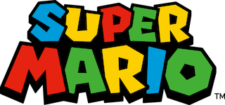

# MarioBros Powers

This is our Mario Bros RPG game repository! Dive into the enchanting world of Mario, where you can select your favorite character and harness unique powers for an immersive gaming experience.

This project is a joint endeavor, showcasing the principles of Object-Oriented Programming (OOP) by leveraging JavaScript, modular design, and bundling with Parcel.js. Let's explore the magic of MarioBros!!

## Getting Started

To run this project locally, follow these steps:

1. Clone the repository:
   git clone https://github.com/yourusername/mario-bros-rpg.git

2. Install dependencies:
   npm install

3. Run the development server:
   npm start

Open your browser and navigate to http://localhost:1234 to experience the Mario Bros RPG game.

## Technologies Used

- HTML5
- CSS3
- JavaScript
- Sass
- GreenSock
- Parcel.js (for module bundling)

<!-- ## Implementation Details

➡️Class-Based Population:

- We utilized classes to populate all data displayed on the website.
- The Football_Player class represents a generic football player and contains information such as name, position, appearances, and an infoPlayers method to display player statistics.
- Subclasses (Goalkeeper, Defender, Midfielder, and Forward) extend the Football_Player class and provide additional statistics specific to each player's position.
- Each subclass overrides the infoPlayers method to include position-specific statistics.
- The Football_Team class represents a Premier League team and contains information about the team's name, image, and players.
- The addPlayer method adds a player to the team's list of players.
- The renderTeamPlayers method renders the team's information, including its name, image, and a list of players with their respective statistics.
- The addToDropdown method adds the team's name to a dropdown menu for easy selection. -->

## Developers

Estefania Aguilar -
Maria Jose Linares Rico

## Copyright

The original Mario Bros game, characters, and related materials are owned by Nintendo. This project is a fan-made tribute and is not affiliated with or endorsed by Nintendo. All rights to the original Mario Bros game and characters are reserved by Nintendo.

## License

This project is licensed under the [MIT License](LICENSE) - see the [LICENSE](LICENSE) file for details.
